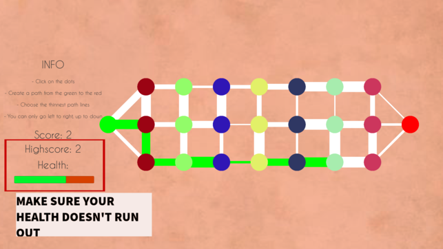

# Thin-Lines

Connect the dots by choosing the thinnest lines!

This is a basic path game where you have to create the path from the green dot to the red dot. However, you must choose the path with the thinnest lines in order to get a higher score and survive.

 I made this during the end of my Sophomore year of high school (Spring 2019). [Download on the iOS App Store!](https://apps.apple.com/us/app/thin-lines/id1452064673)

## HOW TO PLAY

Click on the dots in a left to right, up to down order. You must create a path from the green to the red

## SCORING

The better your path to the optimal path, the less heath you will lose and more rounds you will survive.

## GUI

The basic textures and color schemes appear pleasing to everyone's eyes.

## PURPOSE

This is supposed to be a fun and relaxing game that isn't meant to confuse anyone. All you learn is how well your eyes work in noticing thinness/thickness.

### MOST IMPORTANTLY, GOOD LUCK AND HAVE FUN!

## RUN GAME LOCALLY

To run the game locally, download this project and run it in [Unity](https://unity.com/). 

## CONCEPTS

- Dijkstra's algorithm
- Graphs
